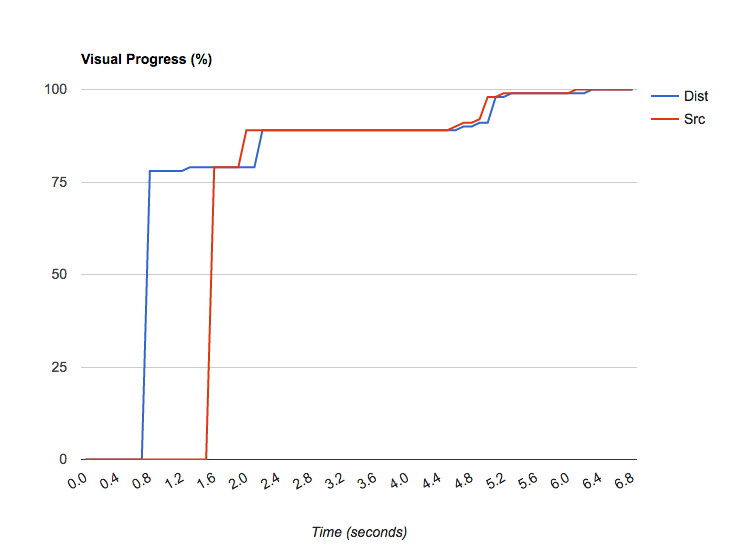

[](https://travis-ci.org/ebiwd/EBI-Corporatesite)

# EBI 'Corporate site' static pages

Static pages for the main www.ebi.ac.uk 'corporate' site.

The pages in this repository will be served as static files (they won't be served with Drupal).

## Why?

Some pages are better served as plain .html files and not through Drupal when:

1. They have very unique layouts (like the front page)
2. There is a need for more speed
3. They are unique and don't have much reusable content (travel page)
4. There is a lot "application" functionality (Services page)

Content from the Drupal site can still be used on static pages through dynamic JavaScript content (i.e. a news feed).

## Making changes to pages

You will need access to the Github repo to make edits (ask your friendly web-dev colleague).

1. Making development edits: All commits will be built and deployed to the EBI wwwdev server.
2. Edits to live site: "tagged" releases will be sent to the production server (this is currently limited to web dev staff).

# Code structure, developing the fonts

## Code structure

Source files are in /src, they map like so:

```
          Source                      Optimised                    Deployed
          ------                      ---------                    --------
Front:    src/index.html           >  dist/index.html           >  www.ebi.ac.uk/
Training: src/training/index.html  >  dist/training/index.html  >  www.ebi.ac.uk/training
```

## Use of branches

We use [Gitlab's CI service* to build the assets](https://gitlab.ebi.ac.uk/ebiwd/EBI-Corporatesite/blob/master/.gitlab-ci.yml); here's the branch structure:

- main: Source code that will be pulled into EBI's Gitlab server for gulp compilation and distribution

* This Gitlab instance is only accessible from the EBI network.

### Versioning

We use semantic versioning style of releases.

| Major release | Minor release | Note |
| ------------- | ------------- | ---- |
| (Branch)      | (Tag)         | |
| master        | .0            | Initial release  |
| master        | .1            | Tagged minor release |

### Test changes

More radical changes should be done on a feature branch.

## Developing content

Serve non-optimised `./src/` files from your dev environment:

- `gulp dev` (alias for `gulp browser-sync`)

## Optimising the pages

If you wish to test the optimisation process on your local machine, here's what you need to do:

NOTE: Only developers would have the need do this.

1. Clone the repo
2. If you're using npm:
  - Install the npm instance: `npm install`
  - Install gulp: `npm install -g gulp`
  - Run the default gulp script: `gulp`
3. If you're using Docker:
  - `docker run -it --rm -v $PWD:/workspace -w /workspace simonvanderveldt/node-bower-gulp:6 bash -c 'npm install --quiet && gulp'`


### What the optimisations get you

As measured with [WebPagetest](https://www.webpagetest.org):

[](https://www.webpagetest.org/video/compare.php?tests=170508_5G_bbac80592e8a6982bb442dfce733f626,170508_66_5c3bd9d66aeb872d713be241f738dba4,170508_4X_18331d7513ef3beae9ddbfec1c8eaf0a)

A comparison of the above two URLs. [View the more detailed report](https://www.webpagetest.org/video/compare.php?tests=170508_5G_bbac80592e8a6982bb442dfce733f626,170508_66_5c3bd9d66aeb872d713be241f738dba4,170508_4X_18331d7513ef3beae9ddbfec1c8eaf0a)

### To do?

- Handlebars optimisations?
- Concat all external css/js?
